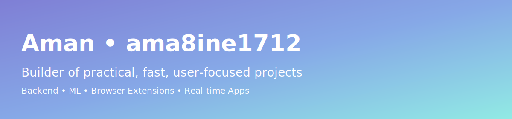

  

<h1 align="center">Hi, I’m Aman (ama8ine1712) 👋</h1>

  Building practical, fast, and user‑focused products — from backend services and ML to browser extensions and real‑time apps.

  
  
  

Tech Stack
----------

  
  
  
  
  
  
  
  
  

Highlights
----------

  
  

  

  

  

Featured Projects
-----------------

  
  

  
  

  

Live Metrics
------------
The following SVG is generated automatically on a schedule and kept in sync:

  

Connect
-------
- GitHub: https://github.com/ama8ine1712
- Email: mailto:your.email@example.com
- Open an issue on any repo for collaboration ideas

—

Thanks for visiting. If you find something useful, consider starring the repositories above.

